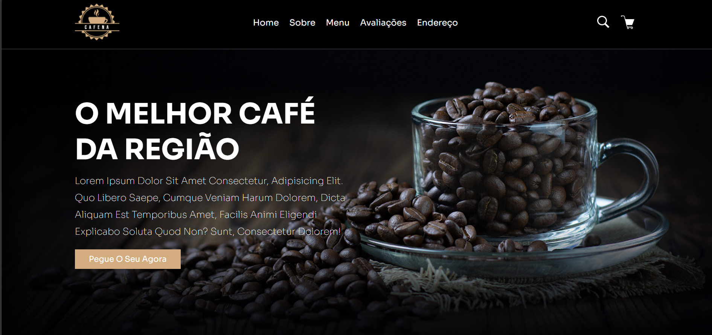

# ☕ Coffee

<p align="center">
  
</p>

<h3 align="center">
Landing Page para uma cafeteria desenvolvida com HTML5 e CSS3.
</h3>

<p align="center">
Projeto desenvolvido para praticar a criação de interfaces modernas, responsivas e elegantes, inspirado no universo das cafeterias.
</p>

<p align="center">
  
  
</p>

---

# 📖 Sobre o Projeto

O **Coffee** é uma landing page criada para representar uma cafeteria, destacando o ambiente, os produtos e a identidade visual da marca.

O projeto foi desenvolvido utilizando apenas **HTML5** e **CSS3**, com foco em estruturação semântica, design moderno e responsividade para diferentes dispositivos.

---

# ✨ Funcionalidades

- ☕ Apresentação da cafeteria;
- 🥐 Destaque para produtos e bebidas;
- 🎨 Interface moderna e elegante;
- 📱 Layout responsivo;
- 🧭 Navegação simples e intuitiva;
- 💻 Código organizado e de fácil manutenção.

---

# 📸 Preview

<p align="center">
  
</p>

---

# 🚀 Tecnologias Utilizadas

- HTML5
- CSS3

---

# 📂 Estrutura do Projeto

```text
coffee/
│
├── assets/
├── css/
├── images/
├── index.html
├── coffee.png
└── README.md
```

---

# ⚙️ Como executar

Clone este repositório:

```bash
git clone https://github.com/Henrique-Wandersee/coffee.git
```

Entre na pasta do projeto:

```bash
cd coffee
```

Abra o arquivo **index.html** diretamente no navegador.

Caso utilize o Visual Studio Code, recomenda-se executar o projeto utilizando a extensão **Live Server**.

---

# 🎯 Objetivos do Projeto

- Praticar HTML semântico;
- Desenvolver layouts modernos com CSS3;
- Criar interfaces responsivas;
- Organizar a estrutura visual de uma landing page;
- Aprimorar habilidades em desenvolvimento Front-end.

---

# 💡 Aprendizados

Durante o desenvolvimento deste projeto foram aplicados conceitos como:

- Estruturação semântica utilizando HTML5;
- Organização visual com CSS3;
- Responsividade para diferentes tamanhos de tela;
- Hierarquia de informações;
- Construção de uma identidade visual inspirada em cafeterias.

---

# 👨‍💻 Autor

**Henrique Wandersee**

GitHub: https://github.com/Henrique-Wandersee

---

# ⭐ Gostou do projeto?

Se este projeto foi útil ou serviu de inspiração, deixe uma ⭐ no repositório. Seu apoio incentiva o desenvolvimento de novos projetos!
